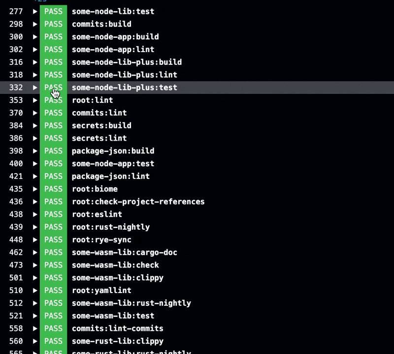
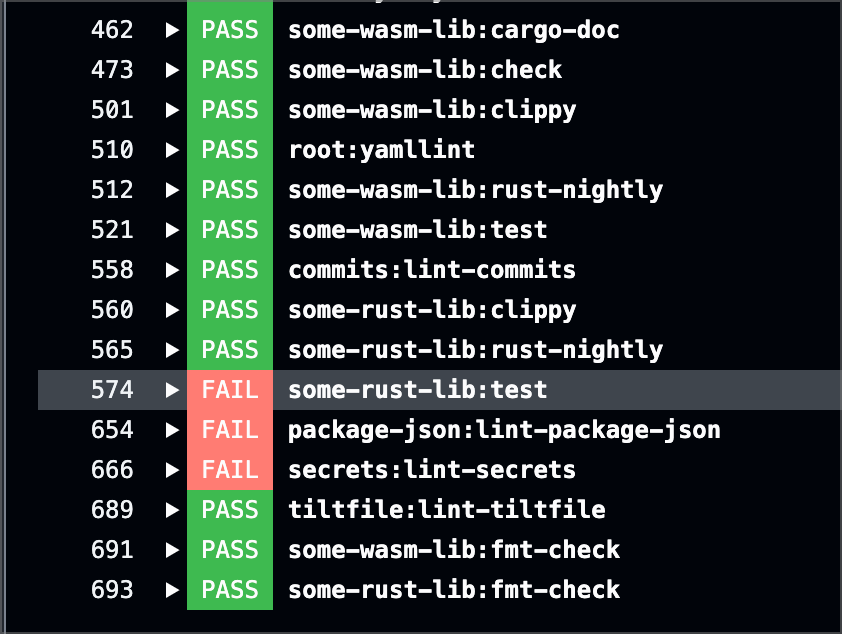
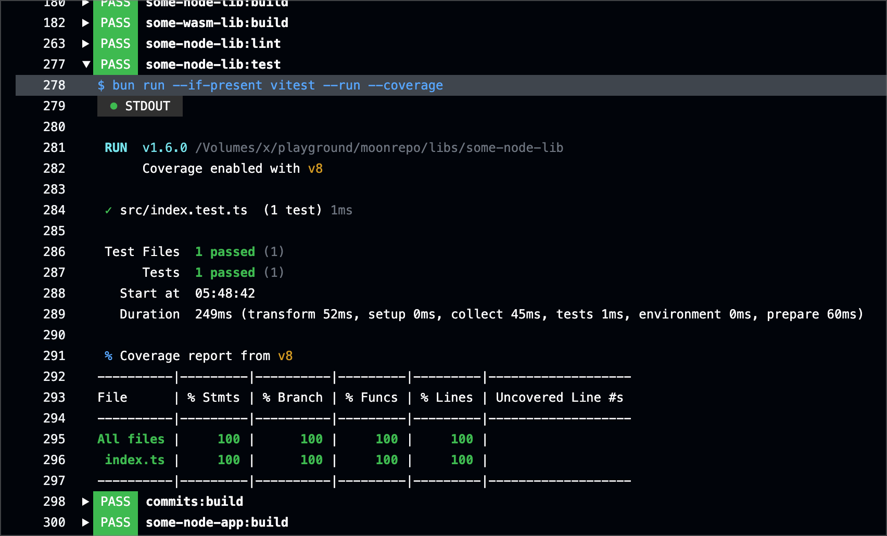
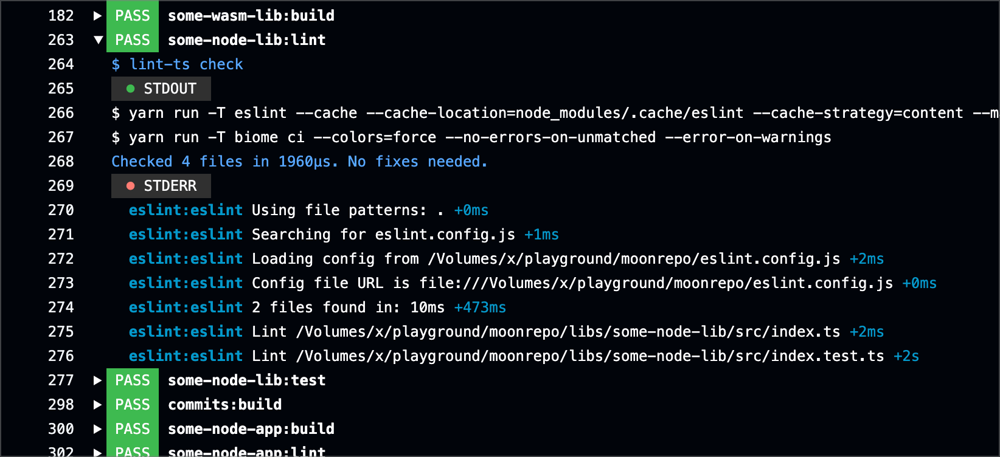
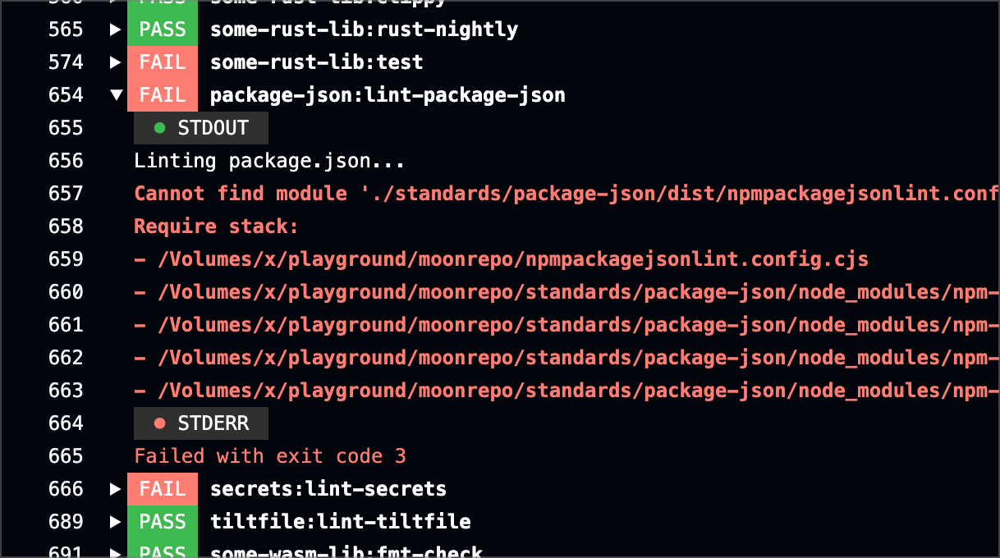

# appthrust/moon-ci-retrospect

This action is designed for projects using Moonrepo, making the test results of the `moon ci` command more readable in GitHub Actions logs.

Typically, `moon ci` executes numerous tasks in parallel, which can make it difficult to view logs in task units. This results in lengthy logs, making it hard to pinpoint the cause of CI failures. This action aims to improve the readability of `moon ci` results, facilitating easier identification of the reasons for CI failures.



|  |  |
|------------------------|------------------------|
|  |  |


## Usage

```yaml
jobs:
  ci:
    name: "CI"
    runs-on: "ubuntu-latest"
    steps:
      - uses: "actions/checkout@v4"
        with:
          fetch-depth: 0
      - uses: "moonrepo/setup-toolchain@v0"
      - run: "moon ci --color"
      # Add this↓
      - uses: appthrust/moon-ci-retrospect@v1
        if: success() || failure()
```

By including this action in your workflow, you can enhance the visibility of test results, making it easier to diagnose and address issues that arise during continuous integration.
